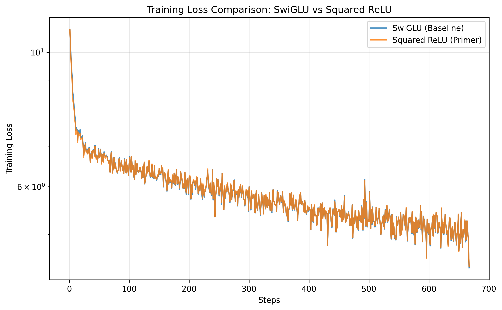

# 🚀 TASK: Squared ReLU Research

We found a **speedup** by switching from SwiGLU to **Squared ReLU** (from the [Primer](https://arxiv.org/pdf/2109.08668) paper) - but it requires additional experimentation and verification.


### 📊 Results (151M Params)
| Activation | FFN Width ($d_{ff}$) | Time to 4.5 Loss |
| :--- | :--- | :--- |
| SwiGLU | 2048 | 1m 59s |
| **Squared ReLU** | **3072** | **1m 52s** |



### 🏎️ Run Benchmark
Test it yourself:
```bash
python compare_ffn_types.py
```

**Open Tasks** (you may do some):
1. Do learning rate search for squared relu.
2. Do learning rate search for swiglu (baseline).
3. Your own improvements

---

### 🛠️ How to Setup & Contribute
We are conducting this research specifically in the **`relu`** branch. Please follow these steps to contribute:

1. **Fork and Clone**:
   Fork the repository on GitHub. **Note:** If you leave "Copy the main branch only" checked, you will need to fetch the research branch manually (see below).
   ```bash
   git clone YOUR_FORK_URL
   cd 5-dollar-llm
   ```
2. **Checkout the `relu` branch**:
   If your fork doesn't have the branch yet, add the upstream and fetch it:
   ```bash
   git checkout relu
   ```
   or
   ```bash
   git remote add upstream https://github.com/Open-Superintelligence-Lab/5-dollar-llm.git
   git fetch upstream relu
   git checkout relu
   ```
3. **Setup Environment**:
   ```bash
   pip install -r requirements.txt
   ```
4. **Download Data**:
   ```bash
   python data/download_hf_data.py
   ```
5. **Experiment & Benchmark**:
   Run the comparison script to verify the current results:
   ```bash
   python compare_ffn_types.py
   ```

6. **Submit a Pull Request**:
   Commit your changes and push to your fork. When opening a PR, ensure the **base branch is set to `relu`** (not `main`).

For a deep dive into the experimental code and discussion, see:
🔗 **[Pull Request #53: Squared ReLU Experiment](https://github.com/Open-Superintelligence-Lab/5-dollar-llm/pull/53)**
