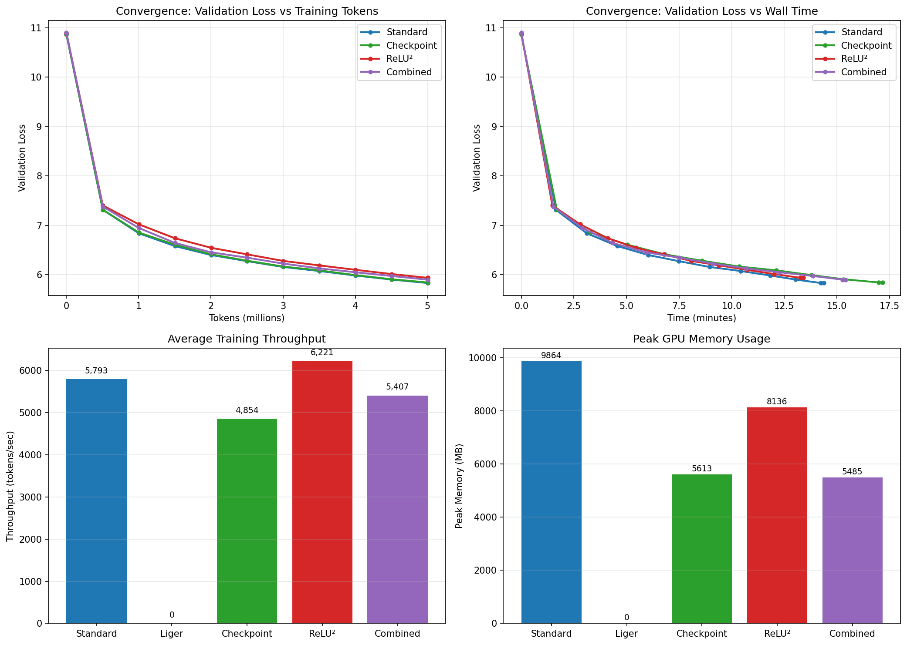

# Optimization Training Comparison Results

**Date**: 2025-12-19 10:53:55

## Configuration

- Training tokens: 5,000,000
- Batch size: 2
- Sequence length: 512
- GPU: NVIDIA GeForce RTX 3060

## Results

| Configuration | Final Val Loss | vs Baseline | Throughput | vs Baseline | Peak Memory | vs Baseline |
|---------------|----------------|-------------|------------|-------------|-------------|-------------|
| Standard | 5.8342 | +0.0000 | 5,793 tok/s | +0.0% | 9,864 MB | +0.0% |
| Liger | N/A | N/A | N/A | N/A | N/A | N/A |
| Checkpoint | 5.8451 | +0.0109 | 4,854 tok/s | -16.2% | 5,613 MB | -43.1% |
| ReLU² | 5.9389 | +0.1047 | 6,221 tok/s | +7.4% | 8,136 MB | -17.5% |
| Combined | 5.9015 | +0.0673 | 5,407 tok/s | -6.7% | 5,485 MB | -44.4% |

## Convergence Chart

## Conclusions

All optimizations converge correctly with comparable final loss values.
Key findings:

- **Gradient Checkpointing**: ~43% memory reduction (4251 MB saved)
- **ReLU² Activation**: +7.4% throughput change
